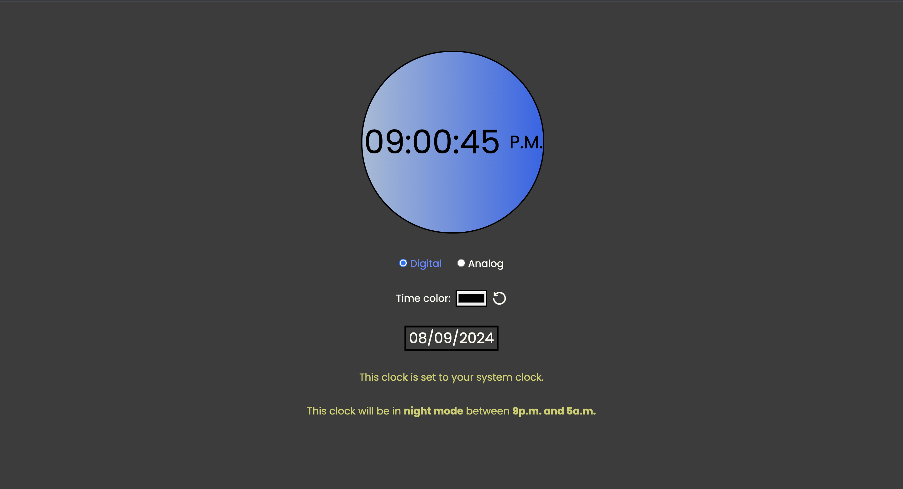

# Digital-Analog DayNight Switch Clock .

A front-end clock project that showcases both digital and analog representations, providing seamless inter-convertibility between the two formats. Additionally, it features an automatic day-to-night functionality with a darker theme that activates between 9 p.m. to 5 a.m. and a brighter theme between 5a.m. to 9p.m. Date in dd/mm/yyyy format is also displayed .

## Features :

- <b><u>Digital Clock</u>:</b>
   Displayed in a 12-hour format with hours, minutes, and seconds.
- <b><u>Analog Clock</u>:</b>
   
  Represented by hour, minute, and second hands over a clock face.
- <b><u>Inter-Convertibility</u>:</b>   Easily switch between digital and analog clock views with a click of a button. -<b><u>Customization:</u> You can customize the clock your way by selecting the color in which time would be displayed</b>
- <b><u>Automatic Day-to-Night</u>:</b>  The clock theme changes to a darker, more eye-friendly version from 9 p.m. to 5 a.m.
- <b><u>Customizable Time olor</u>:</b> User can select the color from the colr picker in which the time should be displayed. It changes the digital time and also changes the color of the numbers in the analog clock
- <b><u>Date(dd/mm/yyyy)</u>:</b>
  Date is updated automatically at 12a.m.
- <b><u>User-Friendly</u>:</b>  
  Simple and intuitive interface for easy interaction. -<b><u>Fully Responsive</u>:</b>
  The webpage will always fit gracefully inside the browser screen, no matter what the size of browser screen is.
   
  Screen size as small as 180px will also show the webpage perfectly  

## Screenshots :

### Day time interface

### Night time interface

### Changing time color

## Technologies Used :

This project has been created using <b>HTML,vanilla CSS ,vanilla javascript</b> .

## Installation and Usage :

1. Clone the repository or download the ZIP file.
2. Open `index.html` in your web browser.

## Contact

Email: sanidhyadobhal2002@gmail.com 
GitHub: Sanidhya-Dobhal
